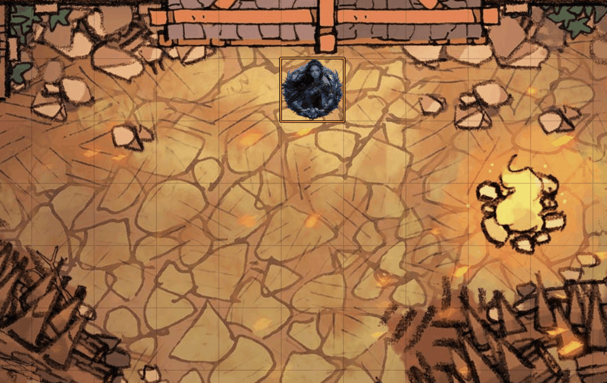

# Bunny Hop  
用于FVTT平台的模组，可以让Token像兔子一样移动。

## 快速使用 
1. 前往FVTT后台的**插件模组**界面。
2. 点击**安装模组**。
3. 将以下内容粘贴到**清单地址**并点击**安装**：
   https://github.com/regex-pie/bunny_hop/releases/latest/download/module.json
5. 在您的世界中启用该模组。
